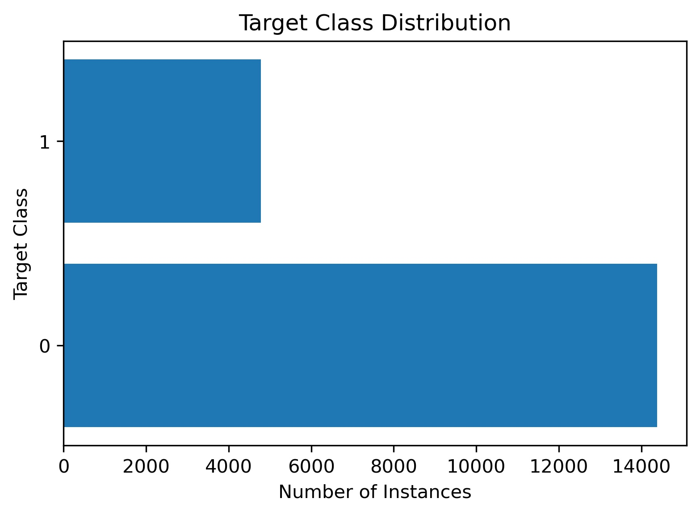
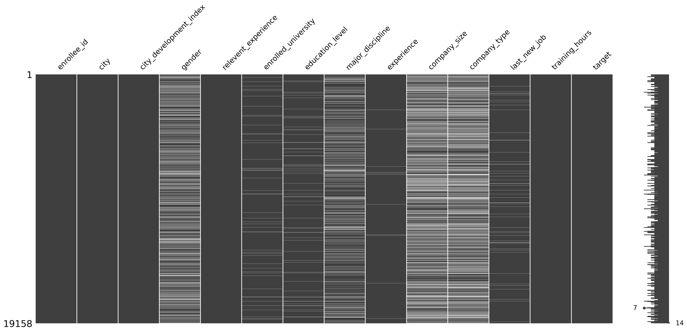
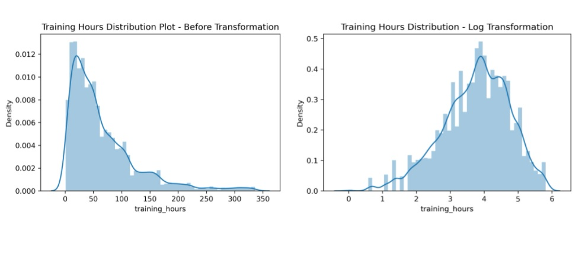
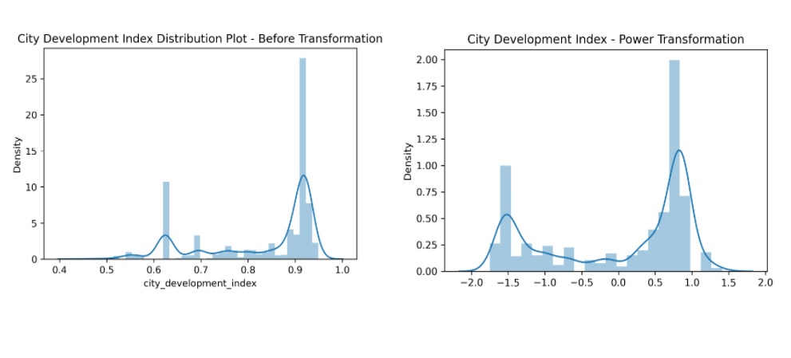
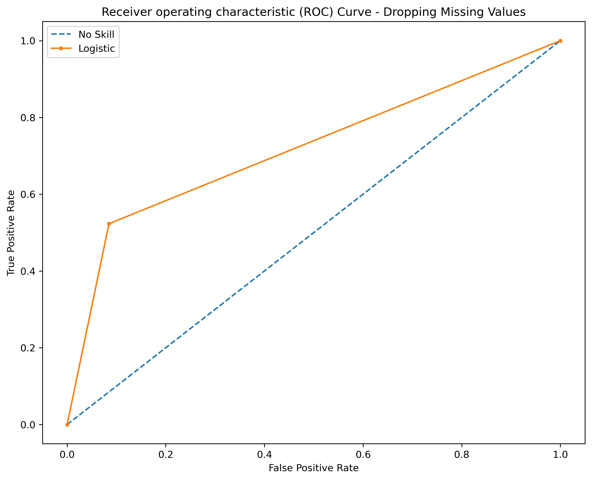
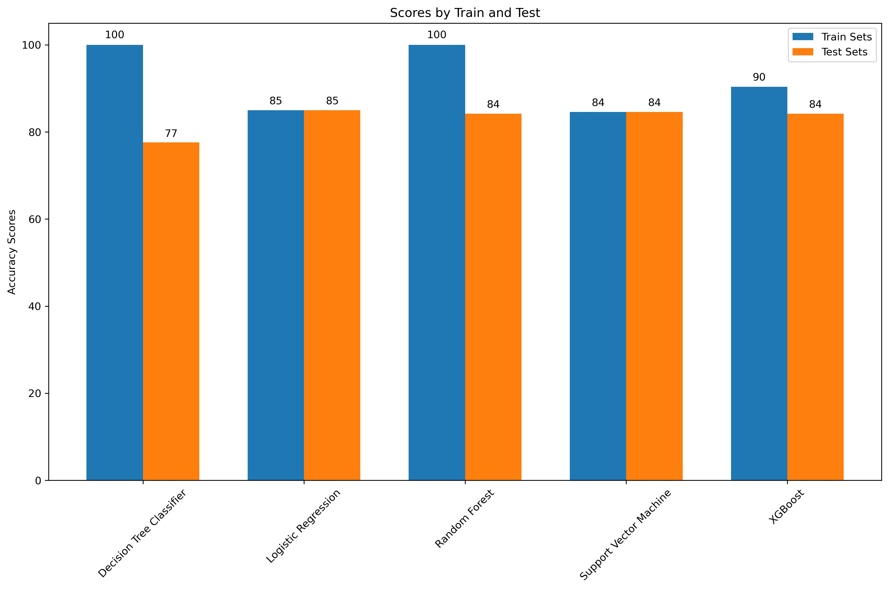
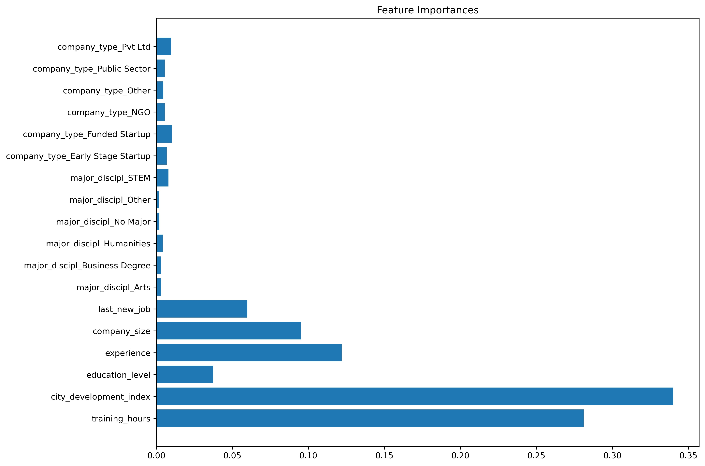
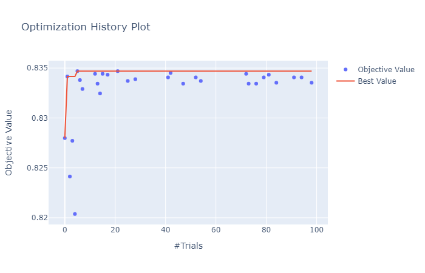
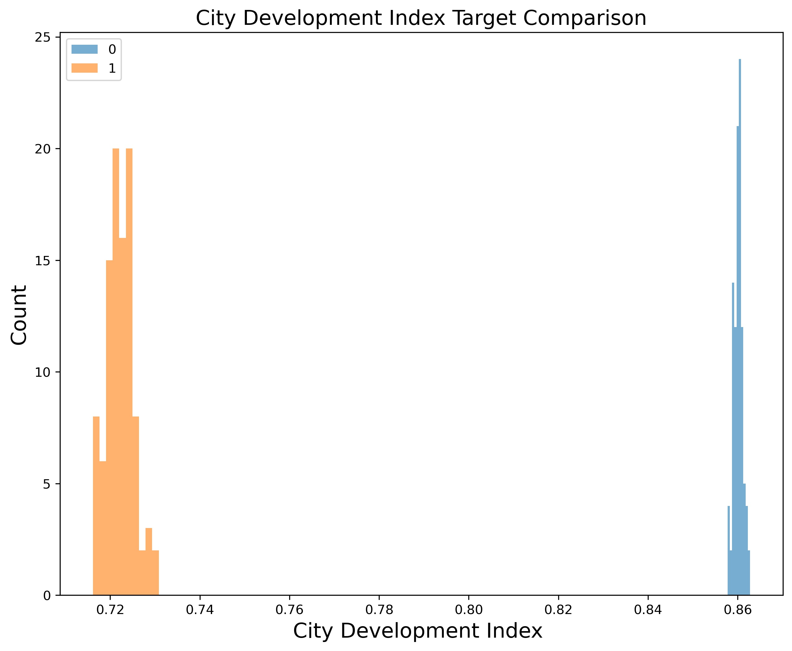
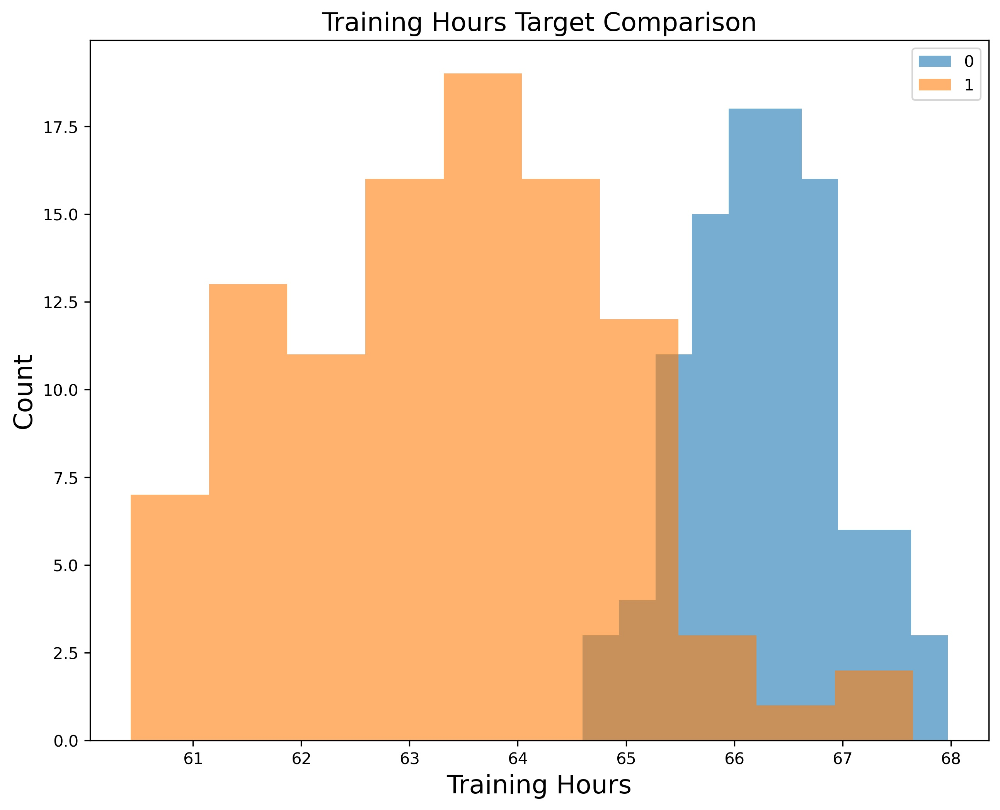

# Stay or Go: Job Change Predictions of Data Scientists

**Author**: Melvin Garcia

## Overview
The aim of this report is to understand the factors that lead a person participating in a company's data science training to either work for their company or look for new employment. The goal is to build a model  using data containing information about a person in data science training. Data points include current credentials, demographics, experience, and training hours. The end result of the model is to provide a probability value that this person will look for a new job or work for the company.

## Business Problem
A company in the business of big data and data science is looking to hire data scientists participating in the courses conducted by said company. Based on characteristics of the individual such as their credentials, demographics, previous work experience, and how long they have been training -- the company wants to understand whether they will work for them after training has completed, or if they will look for new employment. By understanding their predilection for employment, it wil help the company reduce the cost, time, and reform the quality of their training. 

## Data
The data used for this report comes from the human resources department containing personal information about the persons participating in the company's data science training. Data points include: 
- The city the participant is working from
- City development index which measures the level of development on a scale between 0 and 1.
- Relevent experience
- Whether the participant is enrolled in a university
- Education level
- The participant's university major
- Years of work experience
- Company size
- Company type
- Years from when the participant last had a new job
- The number of training hours a participant has done

One characteristic of this dataset is the imbalance of our target variable -- a binary True / False of whether a participant will look for a new job change (1) or they are not looking for a new job change (0). Due the imbalance, during training and testing of the model, I aim to use a stratified k-fold technique to ensure the appropriate proportions of the target variables are used to ensure a more representive sample during training. Another note about this dataset are around the data types we're working with. Specifically, that is the amount categorical data included, and ensuring we encode our columns appropriately as nominal or ordinal. Lastly, there is as much as 30% of missing data in respect to the total number of rows contained within the company size and type columns in respect 

## Methods
The overall steps to set up our data and perform iterative modeling is to:
1. Prepare & Explore the data
2. Clean and transform the data
3. Prepare simple models to evaluate
4. Hyperparameter optimization, and evaluation

**Preparing and Exploring the data**

During our data preparation and exploration step, our aim is to gain an impression of the data and understand the data types, distributions, and amount of missing data we are working with. Based on what we are able to observe, we are then able to develop a strategy on how we would like to approach the data intricacies we ecounter so that for the models we test, and use -- the results are interpretable. For example, skewed distributions, encoding our categorical features appropriately for nominal vs ordinal data, and lastly how we would approach imputing missing data.

**Clean and transform the data**

Following data exploration, we would now execute on our strategy for cleaning the data. The most pressing data quality issue discovered within this dataset are the amount of missing values. For example, within the company size and company type features, it was discovered that ~30% of the total rows of the dataset were missing from these two columns. 

We tested three methods of missing value imputation against a simple logistic regression model. The three methods that we tested were: 
1. Simply dropping all missing values
2. Creating a new category called 'missing' to replace the missing values. This is doable since company type and size are categorical feature types.
3. The second method is replacing missing values with the most frequent value within its respective column.

Based on the results of those two methods, we moved forward with the simple model that showcased a higher accuracy score. 

For handling the skewed distributions within the numeric feature types -- training hours and city development index, we elected to use a log and power transformation respectively to make the distributions more gaussian. 

**Prepare simple models to evaluate**

After preparing a strategy on how we'd like to handle the discovered intricacies of the data (missing values, categorical encoding, and numeric transformations) -- we prepared a pipeline to follow our data transformation strategy and run against a series of simple models.

The simple models tested include:
- Logistic Regression
- Support Vector Machine
- Decision Tree Classifier
- Random Forest
- XG Boost

Specifically, below are the steps performed to prepare and evaluate our simple models:
1. Instantiate our models without hyperparameter tuning
2. Given the imblanced distribution between our target variables, employ a stratified KFold sampling technique to ensure that within the different k folds of the train and test sets, we are testing against representative sample distributions of our target. 
3. Loop over our list of simple models and record the model accuracy against our train and test samples to also evaluate overfitting.
4. Lastly, choose at least 1-2 models to iterate on and perform hyperparameter tuning.

**Hyperparameter optimization, and evaluation**

Lastly, after our simple model evaluation, we selected LogisticRegression and XGBoost to move forward with. We selected these 2 because logistic regression as a simple model exhibited the highest accuracy score, and XGBoost because we can take advantage of the powerful and fast hyperparameter tunining methods contained within the Optuna (https://optuna.org/) python library.

After retrieving the best hyperparameters for both of these models, we again evaluate them on their classification performance -- accuracy and shape of their respective precision-recall curves, and move forward with a final model.

## Results

### Target Class Distribution

As we can see, there is large imbalance between our target variables with our 0 class making up as much as 75% of the total number of instances in the dataset. Therefore, when evaluating our models, we need to not only include accuracy as a metric, but also precision and recall.

### Missing Value Matrix

Most missing values seem to come from 4 features: company_type, company_size, gender, and major_discipline 

Because of the amount of missing columns, we will attempt a couple of methods to working with the missing data.

1. Use a Sklearn's SimpleImputer and replace missing values with 'most frequent'
2. Create an entirely new category called 'missing'

We will use these two methods for our pipeline.

### Training Hours Transformations for Modeling

In the left hand image -- There is an apparent right skew in training hours. In the right image, we apply a log transformation to make the distribution more gaussian and suitable for modeling. 

### City Development Index Transformations for Modeling

In the left hand image -- There appears to be a bimodal peaks with a left skew on the city_development_index column. Applying a power transformation in the right hand image appears to work better in making the distribution more gaussian,however the bimodal peak is still apparent.

### Missing Value Imputation - Simple LR Model ROC AUC Comparison 

Running a simple logistic regression model against the two missing value imputation methods produce very similar scores. However, performing the missing value imputation of creating a new category called 'missing' produces a slightly higher ROC AUC score of 0.647 compared to most frequent imputation ROC AUC score of 0.634. 

Moreover, the accuracy scores reported for both imputation methods received a score of 77%.

### Simply Dropping Missing Values

Compared to the missing value imputation methods above, it appears that by simply dropping the missing values, we are able to increase our accuracy to 85% and our ROC AUC score to 0.719. Therefore based on the presented methods of handling missing values, we may go forward with dropping missing values. 

It is worth noting that, while dropping missing values improved the performance of our simple model, we did observe a decrease of the number of rows from 19,158 rows to 11,179 -- a 42% reduction.

### Simple Model Evaluations

Notably, there are signs of overfitting occurring within our DecisionTree, SVM, and XGBoost simple models given the higher train set accuracy scores. Nonetheless, it appears Logistic Regression has the highest average test accuracy score and so this is likely the model we want to move forward with and with an optimize.

Moreover, given the popularity, and popular hyperparameter optimization packages available for XGBoost, this is also a model I would like to test and move forward with despite the slight overfitting observed.

### Feature Importance

In order to get a better sense of the features that have a higher relevance in determining whether a participant will work for the data science training company or look for a new job, we used a simple DecisionTreeClassifier and extracted its determined feature importances.

As a result, we are able to observe that the city development index of the city where the participant is from plays the most important role in determining whether they will look for a new job or not. In descending order, the top 6 features include: 

1. City Development Index (from where the participant is from)
2. Training Hours Completed
3. Years of Experience
4. Current Company Size
5. Difference in years between previous job and current job
6. Highest Level of Education

### XGBoost Hyperparameter Optimization with Optuna

The plot above showcases the AUC score (y-axis) over the number of trials performed (x-axis). Through the 100 trials performed during hyperparameter tuning, it was observed that at trial 5, we received our highest AUC score of 0.834. From Optuna, we are able to pull the best params and perform final modeling. 

### City Development Index Comparison

In the visual above, I bootstrapped the target variables to generate a distribution over each targets' city development index to provide a comparison of how city development index plays as a factor for whether a person looks for a new job or not after completing data science training. We can observe that people who are not look for a job typically live in better developed cities compared to people in looking for jobs in lower developed cities.

### Training Hours Comparison

In the visual above, I bootstrapped the target variables to generate a distribution over each targets' training hours to provide a comparison of how the number of training hours completed plays as a factor for whether a person looks for a new job or not after completing data science training. We can observe that people who are not looking for a new job typically spend more hours training versus people who are looking for a new job.

### Experience Level Comparison

Lastly, through a similar bootstrapping method used in the above two visuals, I looked at how years of experience play as a factor for people looking for a new job or not. It appears that typically people with 9 years or less experience are more open to looking for new roles compared to people who have 10+ years of experience, where they are more likely to stay put in their current role. 

## Conclusions

Regarding the features that have the most impact of a person's decision into looking for a new role or not, I would highlight City Development Index (city development score of where the employee is from), the number of training hours completed, and the amount of experience an employee has as the top 3 factors. Moreover, from a modeling stand point, I would continue to iterate on the XGBoost model in hopes of collecting more data on people who are looking for a new job to counteract the imbalance of the dataset. Currently, our model is still performing quite poorly on our recall metric -- roughly 0.49 for our class of employees looking for a new role. Given the company's objective to reduce cost, and lost time for employees looking for a new role, we would want to correctly identify employees looking for a new role, and avoid mistaking these employees for those looking to stay. Otherwise, if we think an employee is staying, but in reality they are leaving, then there associated cost and time.

## Next Steps
Based on the presented analysis, there are more steps we can take to improve our model. One step is to continue experimenting with other methods of missing data imputation, and build iterative modelling on top of these other methods. Another step that will take a collective effort from the company is prioritizing data quality, and ensuring no further missing data. The last note to best improve the model is to collect more high quality data, especially data on employees looking to leave their role. 

## Sources
- “ROC Curves and Precision Recall Curves for Classification in Python.” Machine Learning Mastery, https://machinelearningmastery.com/roc-curves-and-precision-recall-curves-for-classification-in-python/
- “How to Use ROC Curves and Precision-Recall Curves for Classification in Python”, Machine Learning Mastery, https://machinelearningmastery.com/roc-curves-and-precision-recall-curves-for-classification-in-python/
- Brownlee, Jason. Data Preparation for Machine Learning: Data Cleaning, Feature Selection, and Data Transforms in Python. V 1.2 Data Preparation for Machine Learning, 2021

## For More Information

Please review our full analysis in [our Jupyter Notebook](./0-HR Analytics-Job Change of Data Scientists.ipynb) or our [presentation](./DSJobChange_HRAnalytics_Flatiron_Presentation_MG.pdf).

For any additional questions, please contact **Melvin Garcia garciamelvin4@gmail.com**

## Repository Structure

```
├── README.md                           
├── 0-HR Analytics-Job Change of Data Scientists.ipynb  
├── HR Analytics-Job Change of Data Scientists.pdf
├── DSJobChange_HRAnalytics_Flatiron_Presentation_MG.pdf
├── aug_train.csv
├── aug_test.csv
└── images
```
